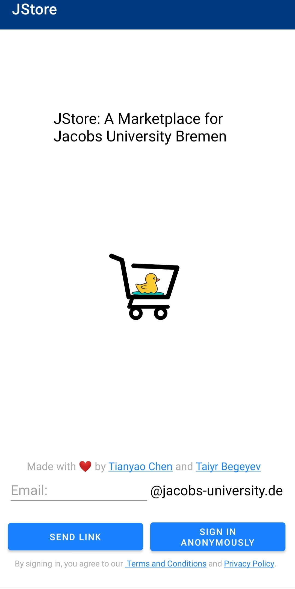
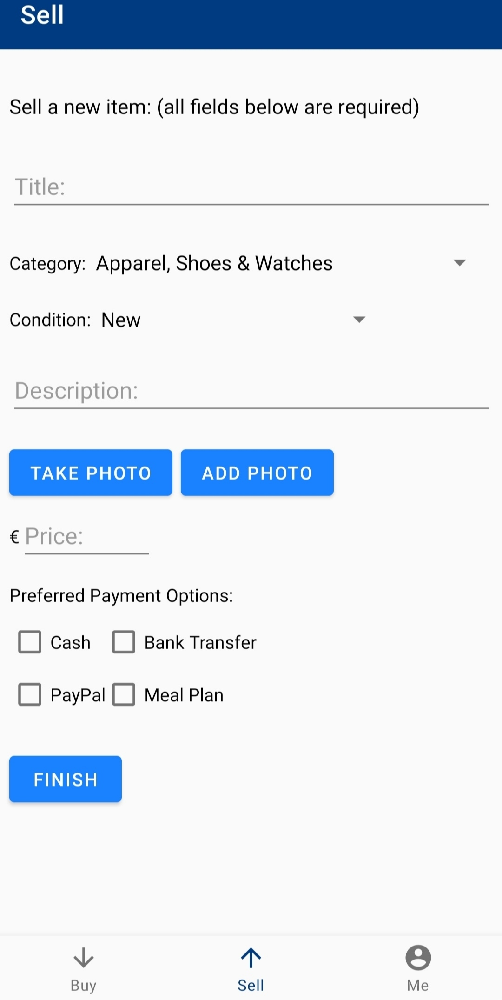

# JStore_Android

* [JStore_Android](#jstoreandroid)
  * [About](#about)
  * [Current Status](#current-status)
  * [Tech Stack](#tech-stack)
  * [Screenshots](#screenshots)
  * [Enabled Features](#enabled-features)
  * [Miscellaneous](#miscellaneous)

## About

JStore: A Marketplace for Jacobs University Bremen. This is the Android app. The [Web version](jstore.xyz) is also under development by
my friend [Taiyr Begeyev](https://github.com/taiyrbegeyev). The iOS app
will be developed later.

## Current Status

I'm almost finishing the app. Now I'm working on searching, filtering, and notifications. You can already use the first release from the release section:D The first version is under review in Google Play Store.

## Tech Stack

* Firebase (Auth, Cloud Firestore (NoSQL), Storage (Google Cloud Platform))
* Java
* Kotlin (In the future)
* Android Jetpack (Navigation Component, androidx, etc.)
* Glide
* FirebaseUI

## Screenshots

## Enabled Features

* Email Link Sign-in with Dynamic Links
* Anonymous Sign-in
* Posting items with a picture (from gallery or taking a photo inside the app),
title, category, condition, description, price, and preferred payment options.
* Seeing the list of items posted in the descending order of creation time.
* Seeing the item's details, which also include two buttons (Email & WhatsApp) to contact the owner.
* Opening the detail page of an item directly from a link.
* Changing user info in the Me Section.
* Checking out your active posts and sold items in the Me Section.
* Marking your posts as sold or deleting them directly.

## Miscellaneous

1. The `app/google-services.json` file is removed from the repository since it contains sensitive information. You'll need to provide your own `app/google-services.json` file to build the app.

## Credits

Special thanks to:

* Taiyr Begeyev for collaborating on the database and storage design.
* Zeyar Oo for tweaking the icon.
* Hamza Hayak for finding critical bugs. 